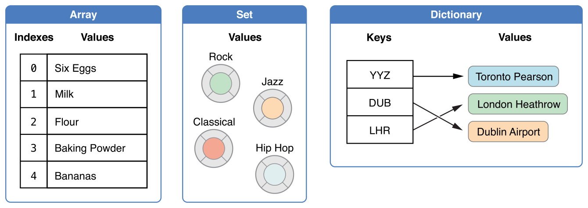
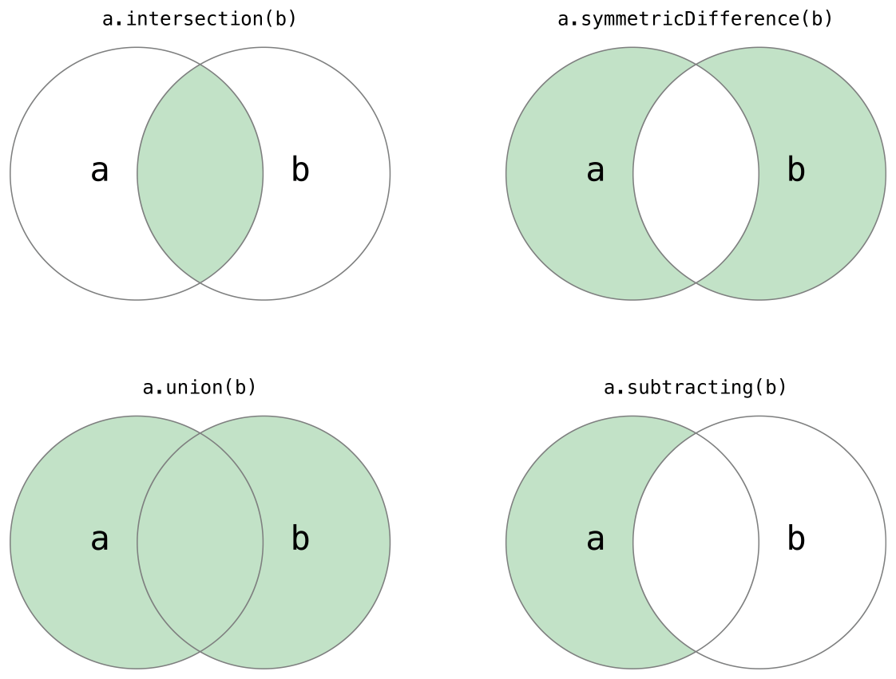

# Collection Types



## 배열

배열은 Array로 적을 수 있는데 축약형으로 [Element] 형태로 사용할 수도 있습니다.

```swift
var arr = [Int]()   // 빈 배열 생성
arr.append(3)       // 배열에 3을 추가
arr = []            // 배열 초기화 (Int 형식은 유지)

// 기본값으로 생성

var defaultArr = Array(repeating: 0.0, count: 3)
defaultArr => Double 타입의 [0.0, 0.0, 0.0]

// + 연산자로 서로다른 배열을 합칠수도 있다.
var sixDoubles = threeDoubles + anotherThreeDoubles

// 리터럴을 이용한 배열의 생성
var foods: [String] = ["eggs" , "milk" , "apple"]

// 배열의 접근
shoppingList[4..6] = ["Bananas", "Apples"]
// 4, 5, 6번째 인덱스 아이템을 Banana, Apples로 변환
// 즉, 아이템 3개가 2개로 줄었다.

```

## 배열의 순회

for - in 구문을 이용해서 배열을 순회할 수 있습니다. 여기서 배열의 값과 인덱스값이 필요하다면 enumarated() 메소드를 사용합니다.

```swift
for name in names{
    print(name)
}
// 인덱스가 필요 없는 경우 ( 값만 확인하고자 할 때 )

for (index, value) in shoppingList.enumerated() {
    print("Item \(index + 1): \(value)")
}
// 인덱스와 값 모두 확인하고 싶은 경우
```


## 셋(Set)

Set 형태로 저장되기 위해서는 반드시 타입이 `hashable`이어야만 합니다. Swift에서 `String, Int, Double, Bool` 같은 기본 타입은 기본적으로 hashable입니다. Swift에서 Set 타입은 Set로 선언합니다.

```swift
var letters = Set<Character>() // 빈 셋 생성

// 배열 리터럴
var favoriteGenres: Set<String> = ["Rock", "Classical", "Hip hop"]
// Swift 의 타입추론으로 아래와 같이 사용할 수도 있다.
var favoriteGenres: Set = ["Rock", "Classical", "Hip hop"]

```

기본적인 메소드는 RangeReplaceableCollection 프로토콜을 동일하게 따르는 배열과 동일하고 셋만의 특별한 메소드는 아래에 나와있다.



```swift
let oddDigits: Set = [1, 3, 5, 7, 9]
let evenDigits: Set = [0, 2, 4, 6, 8]
let singleDigitPrimeNumbers: Set = [2, 3, 5, 7]
​
oddDigits.union(evenDigits).sorted()
// [0, 1, 2, 3, 4, 5, 6, 7, 8, 9]
oddDigits.intersection(evenDigits).sorted()
// []
oddDigits.subtracting(singleDigitPrimeNumbers).sorted()
// [1, 9]
oddDigits.symmetricDifference(singleDigitPrimeNumbers).sorted()
// [1, 2, 9]
```

이렇게 집합연산을 사용하는 것 말고도 `포함관계`를 위한 메서드도 준비되어있다.

```swift
let houseAnimals: Set = ["🐶", "🐱"]
let farmAnimals: Set = ["🐮", "🐔", "🐑", "🐶", "🐱"]
let cityAnimals: Set = ["🐦", "🐭"]
​
houseAnimals.isSubset(of: farmAnimals)
// 참
farmAnimals.isSuperset(of: houseAnimals)
// 참
farmAnimals.isDisjoint(with: cityAnimals)
// 참
```

## 사전 ( Dictionaries )

[Key: Value] 형태로 Dictionary를 선언해 사용할 수 있습니다.

```swift
// 빈 딕셔너리의 생성
var namesOfIntegers = [Int: String]()
// 딕셔너리 리터럴
var airports: [String: String] = = ["YYZ": "Toronto Pearson", "DUB": "Dublin"]
// 딕셔너리에서의 값 추가 
airports["LHR"] = "London"

```