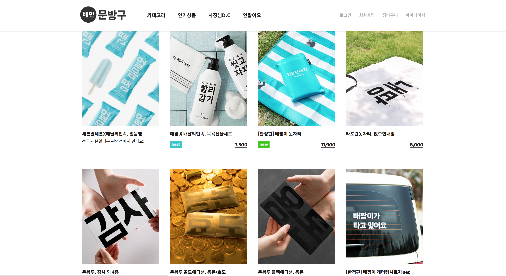
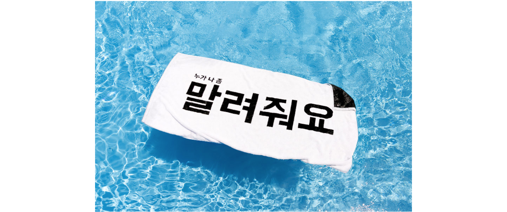
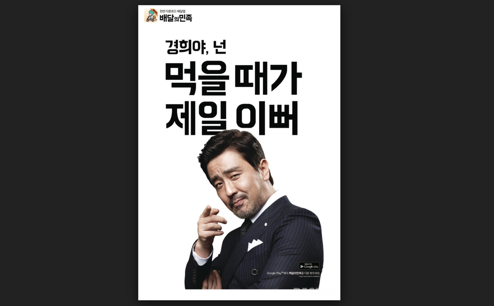
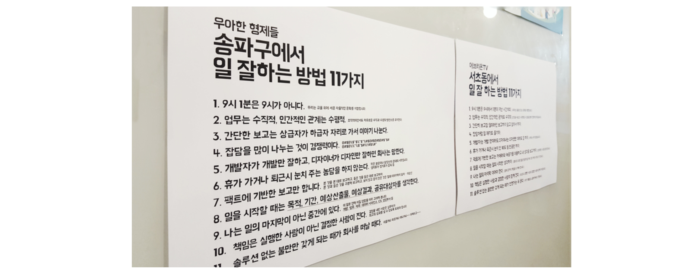

# 작은 브랜딩 위대하게

## 한명수 이사님 ( 배달의 민족 CCO )

배달의 민족에서 일하는 모습을 보여주겠다.

- 9번째 회사 ( 잘 될것 같아서 들어갔다. )

## 수수료를 안뗀다 . 대신 광고비로 해결한다.
- 전화하기 싫은 세대 덕분에 운 좋게 잘 된것 같음
- 돈을 벌며 좋은 일터 문화를 만드는 것에 집요한 관심을 가진다.

## 내재화 O 외주 X !!
- 디자인 52명밖에 없음 총 800명
- 외주를 안 맡기는 이유는?
- 결국 돌아온다. 그럴바에는 직접 만든다.

## 이상한 것들 왜 만듬??
- 재밌어서 일을 한다
- 쓸데 없지만 꾸준히 하면 되더라 ( 때수건 이상한 물품들 등등.. goods)

처음에 이게 돈이 될까 라는 생각이 있었다. 그런데 그것 보다 만들때 즐거워 하는 것이 느껴져서 일단 해보자 라는 생각이 더 컸다고 한다. 처음에는 적자가 있었지만 꾸준히 하다보니 사람들이 인식하고 즐거워해서 매출이 늘었다.

## CEO 마인드
- 사업보다는 브랜드를 만들고 싶다는 개인적인 욕심으로 시작했다.

## `정보기술`을 활용하여 `배달산업`을 발전시키자
- 좋은 음식을 먹고 싶은 곳에서 

## 배민찬 개발 당시
- 어떻게 UX를 발전시켜서 배민찬을 해야할까 
    - 직접 가서 봤다.
    - 자기의 일이 어떤 영향을 미치는지 직접 봤다. 
    - 스티커를 만들었는데 전체적인 진행이 너무 느려지더라 
    - 구성은? 테이프로 하는데 네일한 사람이 하다가 지워지면 어쩔꺼냐 등등...
    - 배민스러운 디자인이란?? 끊임없이 고민함 
- 처음 비닐일때는 음식물 쓰레기 같아서 맛없다고 글이 올라왔지만 , 집에서 한듯한 느낌으로 해줬는데 맛없다는 댓글이 바로 다 사라짐 
    - 본질 ( 음식 ) 은 같지만 디자인( 포장 ) 만 달라져도 사람들이 느끼는 맛이 다르더라

## 본질과 상관없는 헐렁한 디자인을 정교화 시키는 것을 중요시 여긴다.
- 맹물 , 소금 , 멸치를 주고 디자인을 하라는 것과 똑같다
- 글자는 한나체 온리 
- 별거 없는 것으로 꿰 뚫는게 일이다.
- 싸구려처럼 보이기 딱 좋은 재료를 가지고 있지만 , 우리는 싸구려로 보이지 않도록 만든다.

별것 아닌 것 처럼 보이지만 정말 심혈을 기울여서 만든다. 절대로 별것 처럼 보이지 않도록

## 우리의 아이덴티티

- 먹을 것을 먹음직 스럽게 보여주는것이 중요하다.
- 음식 사진을 달라고 안한다. 직접 가서 찍는다.
- 커뮤니케이션의 본질
    - 의도 생각 감정
    - 포토그래퍼 , 디자이너 들이 자신의 일 한것을 기록한다.
    - 재미없는 업무 보고서를 재미있게 만들었다. 
    - 업무가 재미있어 진다.

## 작업이 쉽다는 것은 망했다는 것이다.
- 도전할 일이 없다.
    - 기획이 오면 정답이 떠오른다. 일하고 집에간다
    - 따라서 일을 힘들게 한다. 도전하고 싶도록 
    - 창작의 즐거움이 회복되도록 

## 경희야 넌 먹을때가 제일 이뻐 
- 우리가 어떤 민족입니까?
    - 질문을 던지면서 사용자와 커뮤니케이션을 하고 , 경희 영미등을 사용해 커뮤니케이션을 한다
    - 사용자와 여러번 커뮤니케이션을 통해 각인시킨다.
- 기존 모델링이였다면 컬러를 넣던지 뭐든지 추가하려고 했을 것이다.
- 여기서 하나의 퀘스쳔이 생겼다 : 오래 갈까? ( 개그는 오래 못간다. )
    - 그일을 내가 하게 되더라...

## 일관성 있게 가면서 새롭게 보여주셔야죠 이사님
- 일관성과 다형성을 둘다 만족 시켜야 디자인을 할 수 있다.
    - 사람이 그렇다. 사람은 변하지 않지만 만날 때마다 새롭다.
- 잘 안되길래 , 원래 하던 것을 제대로 하자
    - 직접 글을 그렸다. ( 한나체를 직접 쓴다. )
- 결국 일의 방식이 바뀌는 것이지 결과는 똑같다. 그런데 뭔가 된다.

## 같은것을 오래 지속? 
- 좋지만 지겹다. 
    - 똑같은 것을 계속 할 때의 지겨움이 있다.
- 장난으로 시작한 것들이 하나의 마케팅이 되었다. ( 치믈리에 시험 )
    - 진정한 시험과 진정한 축하를 담았다. 쇼가 아니다. 
    - 와달라던 기자들이 평소에 안오더니 시험때 갑자기 오더라.

## 일을 할때의 방법
- 결과물의 샘풀을 만든다.
    - 샘플을 만들고 싶어서 열심히 하더라
- 예측은 안한다. 
    - 잘되면 하고 안되면 거두면 된다.
    - 서로 공유 하면서 바로 피드백이나 결정을 한다.
- 하찮은 것들을 장엄하게 관찰해서 하면 뭔가 된다.
- 일은 수직적으로 , 관계를 수평적으로 

# 강의가 끝나고 느낀 것

정말 배민 가고 싶었음. 물론 디자인 위주로 강의를 진행하셨지만, 듣는 내내 힘들겠지만 정말 일할 맛 나는 회사구나 라는 것을 느꼈다.

특히 회사내 문화들을 들어보면 수평적으로 관계를 유지하는 것에 대해 굉장히 많이 신경을 쓰는 것 같았다. 퇴근할때 인사를 안하도록 플랜카드를 걸어놓는다던지 , 송파구에서 일 잘하는 11가지 방법 등등을 보면 문화가 정말 좋구나 라는 생각이 든다.

일을 힘들게 하는 것을 안좋게 볼 수도 있지만 , 그 만큼 자신이 성장하는 것을 느끼도록 만들어 주는 회사 인 것 같다.