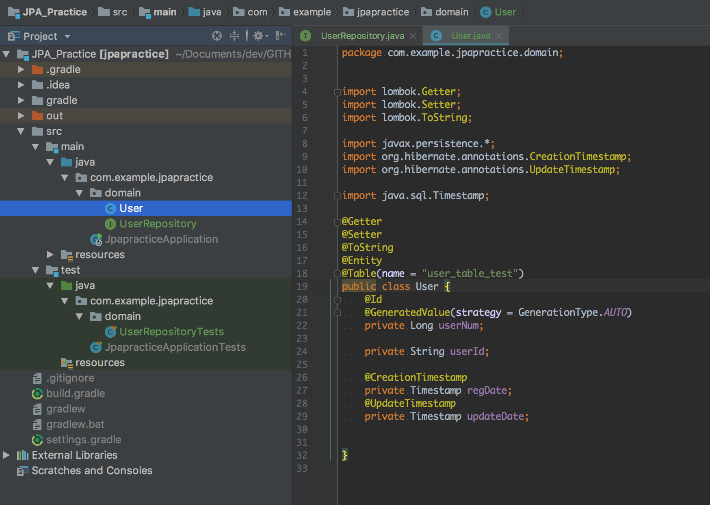
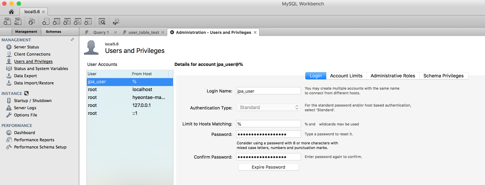
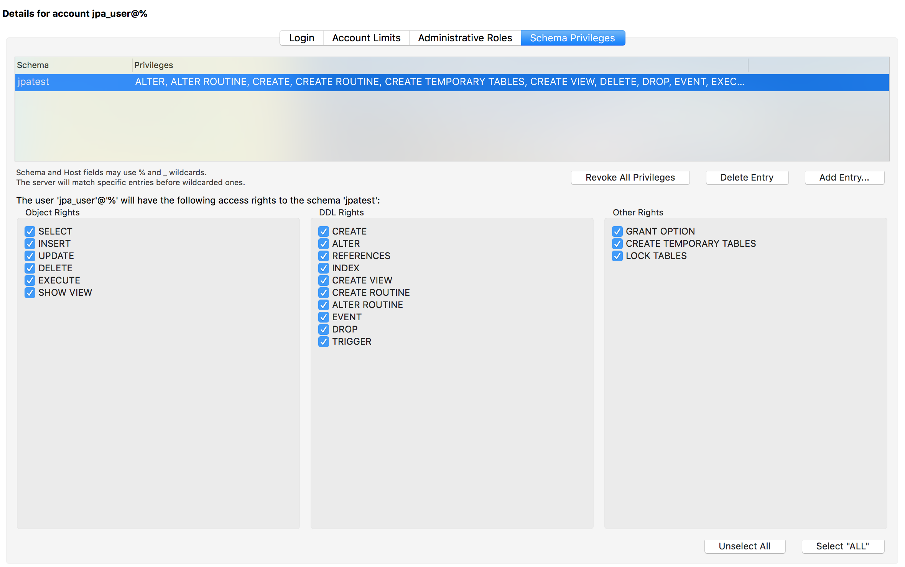
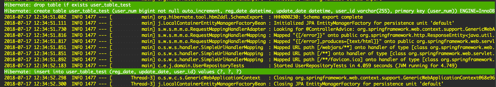
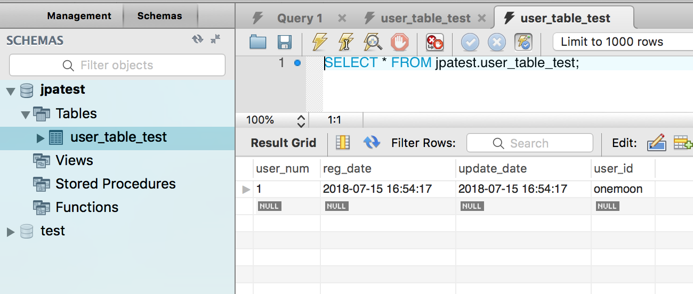

# JPA Practice

```
테스트 환경 

MYSQL 5.6
SpringBoot 1.5.14
Gradle 
```

## 엔티티 클래스 설계

관계형 데이터베이스에 대이터를 보관하려면 테이블을 생성해주어야 하는 것 처럼 , 자바에서도 어떠한 객체를 만들려면 일단 클래스를 설계해야 합니다. JPA는 자동으로 테이블을 생성해주는 역할을 할 수 있으며 , `1) SQL 을 이용해서 테이블을 생성하고 엔티티 클래스를 만드는 방식`이나 `2) JPA를 이용해서 클래스만 설계하고 자동으로 테이블을 생성하는 방식` 을 사용할 수 있습니다. 여기에서는 2) 방식을 사용하겠습니다.

2) 방식은 아래와 같은 프로세스를 통해서 진행됩니다.

1. 객체지향의 설계대로 클래스들을 설계합니다.
1. @Id , @Column 등을 이용해서 각종 제약조건을 추가하고 , 설정합니다.
1. 엔티티 간의 관계를 설정합니다. 


보통 엔티티 클래스는 domain 이라는 패키지를 만들어서 관리합니다. 자신의 프로젝트 아래에 domain 이라는 패키지를 만들어줍니다.

##### @Getter , @Setter는 lombok 이라는 플러그인을 설정한 것입니다. lombok을 설정하게 되면 getter와 setter , toString 등을 자동으로 생성해줍니다. 익숙하지 않다면 getter와 setter를 직접 작성하시거나 , [lombok](https://projectlombok.org/features/all)을 방문해보시길 바랍니다.



## JPA 를 위한 어노테이션 추가

> 최소한의 어노테이션만 사용했습니다. 더 많은 정보를 원하시면 [annotation](http://www.datanucleus.org/products/datanucleus/jpa/annotations.html) 을 확인하세요 !

- #### @Entity
    - 해당 클래스의 인스턴트들이 엔티티임을 명시합니다.
- #### @Id
    - 해당 변수가 PK임을 명시하는 중요한 어노테이션 입니다.
    - 모든 엔티티에 반드시 하나 이상은 있어야 합니다.
    - 식별키를 지정하는 방식은 여러가지가 있습니다.
        1. 사용자 직접 지정
        1. 자동으로 생성
        1. 별도의 방법
        - MySQL에서는 Auto Increment가 있으므로 이를 사용하겠습니다. 
            - @GeneratedValue
            - SpringBoot 2.0 부터는 strategy를 설정이 다를 수 있으므로 [참고](http://jojoldu.tistory.com/295?category=637935)하시길 바랍니다.
- #### @Column
    - 해당클래스의 변수가 칼럼이 되기 때문에 각종 제약조건을 추가하기 위해서 @Column 어노테이션을 사용합니다.
    - 대표적으로 table , unique , nullable , length 등이 있습니다.
- #### @Table
    - 클래스의 선언부에 작성해서 테이블명을 어떻게 할 것인지 결정합니다.
    - 만약 생략이 될 경우 클래스 이름과 동일한 이름을 가진 테이블이 생성됩니다.

일단 클래스 선언부에 반드시 @Entity 어노테이션을 붙여야 합니다. 그 후 @Id 어노테이션에 적절한 strategy를 설정합니다.


##### 저같은 경우는 @CreationTimestamp 가 자동으로 임포트가 안되었습니다. <br> 저와 마찬가지로 자동으로 import 되지 않는다면 직접 import org.hibernate.annotations.CreationTimestamp; 를 입력하시길 바랍니다.

@CreationTimestamp 와 @UpdateTimestamp 를 사용해서 언제 생성 , 업데이트 되었는지 자동으로 확인 할 수 있도록 하였습니다. 이로서 기본 엔티티 클래스 설계를 마쳤습니다.

## application.properties 설정

스프링부트에서 jpa 를 사용하면 필수적으로 application.properties를 설정해야 합니다. 데이터베이스 연결을 설정하는 파일입니다. 이부분에 많이 막히실 것으로 예상됩니다... ^^... ( 특히 gradle 과 mysql 호환 문제 때문에 조금 고생했습니다. )

Mysql 을 사용하기 위해서 [Mysql Connector](https://mvnrepository.com/artifact/mysql/mysql-connector-java)를 사용해야 하며 , 버전을 잘 맞추는 것이 좋습니다.

취향이지만 데이터베이스는 최대한 보수적으로 ( stable 한 버전 ) 사용하는 것이 좋습니다. [mvnrepository](https://mvnrepository.com/)에서 많이 사용하는 것을 쓰시길 추천드립니다.

### 기본 설정

```java
spring.datasource.driver-class-name = com.mysql.jdbc.Driver
spring.datasource.url  = jdbc:mysql://localhost:3306/jpatest
spring.datasource.username = jpa_user
spring.datasource.password= jpa_user
// 저는 패스워드를 동일하게 설정했습니다.

```

- driver-class-name
    - driver class 설정입니다. 버전에 따라 다를 수 있으니 꼭 참고하시길 바랍니다.
- url
    - 자신의 컴퓨터에 mysql을 설치해서 사용한다면 기본적으로 jdbc:mysql://localhost:3306를 사용합니다
    - 그 후 자신이 만든 데이터베이스(스키마) 이름을 적습니다.
        - 저 같은경우는 jpatest라는 스키마를 만들었기 때문에 jdbc:mysql://localhost:3306/jpatest를 사용했습니다.
- username , password 
    - 해당 데이터베이스에 접근할 수 있는 user 를 적습니다.  
    - root를 사용할 수도 있지만, user를 만들어서 따로 설정해주는 것을 추천해드립니다.

### 유저 설정
- root 를 사용하신다면 root와 자신의 비밀번호를 사용하시면 됩니다.
- 자신이 유저를 직접 만들어서 권한을 설정해 줄 경우 아래를 참고하시길 바랍니다.
1. 워크벤치에서 데이터베이스 연결 후 유저설정에 들어갑니다. 
1. 패스워드를 지정해줍니다.
1. 유저권한을 넘겨줍니다. 

이로서 데이터베이스를 연결! 하는 것을 마쳤습니다. 이 부분이 생각보다 오래 걸릴 수 있으니 많이 구글링 하시길 바랍니다 ( 제가 그랬습니다... ) 

이제 실제로 데이터베이스를 사용하기 위해서 설정을 해보겠습니다.

## JPA 설정

```java 
spring.jpa.hibernate.ddl-auto = create
# 스키마 생성을 할 수 있도록 설정합니다.
spring.jpa.generate-ddl = false
# DDL 사용시 데이터베이스 고유의 기능을 사용할 지 선택합니다.
spring.jpa.show-sql = true
# 사용되는 SQL 문을 보여줄지 선택합니다.
spring.jpa.database = mysql

logging.level.org.hibernate = info
# 로그 레벨을 지정합니다
spring.jpa.database-platform = org.hibernate.dialect.MYSQL5InnoDBDialect
# Mysql 상세 설정을 합니다.
```

개발을 할 때에는 `spring.jpa.show-sql` 을 true 로 해 놓고 , 프로그램이 실행할 때 동작하는 SQL 로그문을 보면서 개발하는 것이 좋습니다. 이를 생략하시려면 false로 두면 됩니다.

아래는 ddl 설정을 나타냅니다. 익숙하지 않다면 어떻게 프로그램을 돌리면서 mysql workbench를 활용하여 직접 database를 확인하면서 보는 것도 좋은 방법입니다.

- spring.jpa.hibernate.ddl-auto 
    - Data Definition Language 를 처리하는 옵션입니다.
    - create : 기존 테이블 삭제 후 다시 생성
    - create-drop : create와 동일하지만 종료시점에 테이블 drop
    - update : 변경된 부분만 반영
    - none : 사용하지 않음


## JPA 처리를 담당하는 Repository 인터페이스 설계

Spring Data JPA 를 이용하는 경우에 별도의 클래스 파일을 작성하지 않고 원하는 인터페이스를 구현하는 것 만으로도 JPA와 관련된 모든 처리가 끝나게 됩니다. 과거에 DAO 를 이용했듯이 JPA 의 경우에는 Repository라는 용어를 사용합니다.

전통적인 JPA 처리 방식으로 직접 EntityManager 를 건드려 트랜잭션을 설정할 수도 있지만 , 아주 복잡한 상황이 아닌 이상 간단하게 처리할 수 있는 Repository 를 사용하는 것이 더 선호되고 있습니다. 

```
Repository<T,ID>
CrudRepository<T,ID> 
PagingAndSortingRepository<T,ID>
JpaRepository<T,ID>
 ```
##### Repository<T,ID> 가 가장 상위입니다.
인터페이스는 < T , ID > 두 개의 제네릭 타입을 사용하는 것을 볼 수 있는데 , T 는 엔티티의 타입 클래스이고, ID 는 PrimaryKey 값입니다. ID 는 반드시 ( java.io.Serializable ) 인터페이스 타입이어야 합니다.

Repository<T,ID> 는 실제로 별 기능이 없기 때문에 가장 많이 사용되는 것은 기본적인 CRUD(Create Read Update Delete ) 기능이 있는 `CrudRepository<T,ID>` 

혹은 페이징 처리, 검색 등이 가능한 `PagingAndSortingRepository<T,ID>` 가 많이 사용되고 있습니다.

JPA 에 특화된 몇 개의 기능을 가진 `JpaRepository<T,ID>` 를 사용할 수도 있습니다.

### 실제로 적용해보기

인터페이스를 설계하는 것 만으로도 많은 기능들이 자동으로 개발이 되기 때문에 생산성을 향살 시킬 수 있습니다. 그렇다면 실제로 Repository를 만들어 어떤 마법이 펼쳐지는지 살펴보겠습니다. 먼저 UserRepository를 다음과 같이 작성합니다. 

```java
package com.example.jpapractice.domain;
import org.springframework.data.repository.CrudRepository;

public interface UserRepository extends CrudRepository<User, Long>{
    // 빈 공간입니다.
}
```

그리고 테스트 코드를 작성하겠습니다.


```java 
package com.example.jpapractice.domain;

import org.junit.Test;
import org.junit.runner.RunWith;
import org.springframework.beans.factory.annotation.Autowired;
import org.springframework.boot.test.context.SpringBootTest;
import org.springframework.test.context.junit4.SpringRunner;

@RunWith(SpringRunner.class)
@SpringBootTest
public class UserRepositoryTests {

    @Autowired
    UserRepository userRepo;
    // 사용하려는 Repository를 주입해주었습니다.

    //Basic
    @Test
    public void testBasic(){
        System.out.println(userRepo.count());
        userRepo.findAll().forEach(usr->{
            System.out.println(usr);
        });
    }

    //Create
    @Test 
    public void testIns(){
        User usr = new User();
        usr.setUserId("onemoon");
        userRepo.save(usr);
    }
    
    //Read
    @Test
    public void testRead(){
        if(userRepo.exists(1l)){
            User usr = userRepo.findOne(1l);
            System.out.println(usr);
        }else
            System.out.println("No Data");
    }
    
    //Update
    @Test
    public void testUpdate(){
        if(userRepo.exists(1l)){
            User usr = userRepo.findOne(1l);
            System.out.println(" orizinal : "+usr.getUserId());
            usr.setUserId("onemoon_upd");
            System.out.println(" updated : "+usr.getUserId());
            userRepo.save(usr);
        }else
            System.out.println("No Data");
    }

    //Delete
    @Test
    public void testDel(){

        System.out.println(" DELETE ");
        // 예외 처리 필요함( id 가 없는 경우 )
        if(userRepo.exists(1L))
            userRepo.delete(1L);
        else
            System.out.println("Fail : No data");

        userRepo.findAll().forEach(usr->{
            System.out.println(usr);
        });
    }

    @Test
    public void testByUser_id(){
        userRepo.findUserByUserId("onemoon").forEach( user ->
            System.out.println(user)
        );
    }
}

```

코드를 상속한 CrudRepository 인터페이스는 `save()`라는 메소드를 이용해 데이터베이스에 엔티티 정보를 추가하거나 수정 한다는 것을 알아두셔야 합니다. 

Repository 쪽에서 save() 메소드가 호출된다면 , 내부적으로 엔티티매니저가 영속컨텍스트에 해당 식별키를 가진 엔티티가 존재하는지를 확인하고 처리합니다. 존재하지 않는다면 영속컨텍스트에 저장하고 DB에 추가하게 되며 , 존재한다면 update를 처리하게 됩니다.

테스트 하나씩 진행해보겠습니다.

### Basic

CRUD 와 별개로 기본적인 메서드들을 몇가지 알아보겠습니다. 

|메서드이름|설명|
|---|---|
| log count() | 모든 엔티티의 개수 |
| boolean exists(ID) | 해당 ID 값을 가진 엔티티가 존재하는지 확인 |
| Iterable<T> findAll() | 모든 엔티티 목록 |

이와 같은 간단한 메서서들이 기본적으로 제공됩니다. 조금 더 자세하게 알고 싶다면 [CrudRepository Docs](https://docs.spring.io/autorepo/docs/spring-data-commons/1.5.1.RELEASE/api/index.html?org/springframework/data/repository/CrudRepository.html)를 확인하세요


### Create 

User 라는 객체를 만들어서 DB에 저장하도록 코드를 작성했습니다. Primary Key 인 userId는 따로 코드를 작성하지 않더라도 내부적으로 증가되는 값으로 저장됩니다. ( User 에 @Id 를 확인하시길 바랍니다. ) 마찬가지로 Timestamp도 자동으로 등록되기 때문에 이름만 추가해서 저장을 해줬습니다. 

잘 따라오셨다면 아래와 같은 결과를 보실 수 있습니다.




##### 콘솔에 저렇게 색깔을 주고 싶다면 grep console 을 검색해보세요!

### Read , Update , Delete
#### 2가지를 꼭 알아두셔야 합니다.
1. `application.properties` 파일 설정을 확인해야 합니다.
    - `ddl-auto 설정`이 create 로 되어있다면 매번 테이블이 drop 되고 생성되기 때문에 기존에 데이터를 사용할 수 없습니다 `따라서 create 할때가 아니라면 update 나 none으로 값을 알맞게 설정`한 후 테스트를 진행합니다.
    ```java
    # 은 application.properties 에서 주석 처리를 나타냅니다.
    # spring.jpa.hibernate.ddl-auto=create
    spring.jpa.hibernate.ddl-auto=update
    ```
1. 테이블 속성 네이밍 규칙
    - 처음에 user_id 라고 사용했는데 검색이 안되어서 굉장히 분노했던 경험이 있습니다... ㅠㅠ
    - 알고보니 userId 라고 칭했을때 jpa에서 자동으로 user_id라는 네이밍 규칙을 통해서 이름을 변경하는 과정을 거칩니다.( `userId -> user_id` ) 이 때문에 가져오는 과정에서 user_id 로 검색하면 잘 안되는 경우였습니다.
    - 따라서 카멜케이스로 네이밍을 작성하고 작업을 진행하시길 바랍니다. 언더바가 들어가면 네이밍이 잘 안맞는 경우가 있습니다.

위의 2가지 상황을 명심하셨다면 크게 무리없이 진행될 것입니다. Read Update Delete 순으로 테스트를 진행합니다. 이로서 간단한 CRUD 작업을 마치겠습니다.


## 마무리 

사실상 위에 있는 코드만으로 실제 서비스에 적용하는 것은 당연히 무리가 있습니다. 하지만 기본적인 방식이나 흐름등을 느끼기에 CRUD 작업만큼 좋은게 없다고 생각합니다. ( 게시판 만들기 등을 추천드립니다. )

사진도 첨부되어있고 코드로 써놓은 부분도 있습니다. 반드시 `하나하나 따라하시면서 직접 손코딩` 하시길 바랍니다.( 개인적으로 복붙은 큰 의미가 없다고 생각합니다. )

다음 JPA 포스트에서는 기본 CRUD 쿼리에서 벗어난 다양한 처리를 위한 쿼리들을 예제로 준비해보겠습니다.


> 참고 
>> Book    : [스타트 스프링 부트](http://www.namgarambooks.co.kr/entry/8-%EC%8A%A4%ED%83%80%ED%8A%B8-%EC%8A%A4%ED%94%84%EB%A7%81-%EB%B6%80%ED%8A%B8?category=584781) <br>