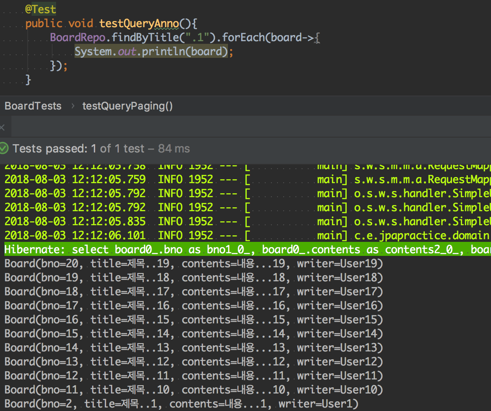

# @Query(Query Annotation) 이용하기

쿼리어노테이션을 사용하는 이유는 여러가지 이유가 있겠지만 먼저 인덱싱에 대해서 얘기를 해보겠습니다.

## JPQL 을 이용해서 제목에 대한 검색처리 하기 

JPQL에 대해서 말씀 드리기에 앞서 간단한 제목 검색 쿼리를 작성해보겠습니다.

```java
// BoardRepository.java
@Query("SELECT b from Board b where b.title like %?1% and b.bno >0 order by b.bno DESC")
public List<Board> findByTitle(String title);

@Query("SELECT b from Board b where b.title like %:title% and b.bno >0 order by b.bno DESC")
public List<Board> findByTitle2(@Param("title") String title);

```

첫번째 쿼리를 살펴보면 중간에 `%?1%` 는 함수의 파라미터가 들어갈 자리이며 만약에 2개 이상의 파라미터가 쿼리 메소드에 들어가야 한다면 `%?N% (N은 숫자)` 으로 늘려나가면 됩니다. 

두번째 쿼리는 조금 더 명시적으로 알 수 있습니다. `@Param` 파라미터를 이용해 어떤 이름을 가진 파라미터를 사용할 것인지 선언해준 뒤 쿼리상에서 `%:Name%`에 적어주면 동일하게 적용됩니다. 편한 방법을 사용하시면 됩니다.

그리고 값이 포함된 제목을 가진 글을 검색하는 테스트 코드를 작성한 뒤 실행해보겠습니다.

// BoardTests.java


위와같이 정상적으로 동작하는 것을 확인하면 됩니다. 

그렇다면 어디에 JPQL 이 사용되었을까요?? `@Query`를 유심히 살펴보시길 바랍니다. 데이터베이스에 동일한 쿼리 find Board 를 날리면 board가 존재하지 않기 때문에 에러가 날것입니다. 

`JPQL은 객체 쿼리`입니다. `JPA 에서 사용하는 Query Language` 로서 SQL과 유사하게 작동하고 , JPA 구현체에서 객체 자체를 해석해서 쿼리를 날릴 수 있도록 합니다.

가장 큰 특징은 테이블 대신에 엔티티 타입을 입력하고 칼럼명 대신에 엔티티 속성을 이용해서 사용자들의 쿼리를 조금 더 직관적으로 작성할 수 있도록 도와줍니다. 그렇기 때문에 @Query에서 테이블이 아닌 엔티티 자체를 검색에 넣었음에도 불구하고 제대로 작동한 것이죠. 

## @Query의 장점

JPQL에 대해서 알아봤으니 @Query의 몇가지 장점에 대해서 얘기해보겠습니다. 왜 @Query 를 사용하는 것이 좋을까요??

1. 필요한 몇개의 칼럼들만 추출해서 사용하는 경우
    - 엔티티 타입의 경우는 모든 칼럼을 조회하지만 굳이 그러지 않아도 되는 경우는 쿼리어노테이션을 통해 필요한 칼럼들만 추출할 수 있습니다.
1. nativeQuery 속성을 지정해서 데이터베이스의 SQL을 사용하는 경우
    - 쿼리 튜닝등의 작업으로 인해 SQL 자체를 그대로 사용하고 싶은 경우가 있을 수 있습니다.
    - 이를 nativeQuery 속성을 통해서 그대로 사용할 수 있습니다.
1. Repository에 지정된 엔티티 타입 + 필요한 엔티티타입 을 다양하게 사용하는 경우
    - 여러 엔티티타입을 조회할 수 있기 때문에 한번에 여러 엔티티를 처리하는 경우 유용하게 사용할 수 있습니다.

```java
// BoardRepository
@Query("SELECT b.writer , b.title from Board b where b.title like %:title% and b.bno >0 order by b.bno DESC")
public List<Object[]> findWriterBySearching(@Param("title") String title);

@Query(value = "select bno,title from board_table_test where title like CONCAT('%',:title,'%')",nativeQuery = true)
public List<Object[]> nativeQuery(@Param("title") String title);
```

여러 칼럼을 지정하는 경우 List<Board> 가 아닌 List<Object[]>로 받아야 한다는 것을 유의하셔야 합니다. 이 코드로 테스트 코드를 작성한다면 아래와 같이 됩니다.

```java
@Test
public void testQueryAnno2(){
    BoardRepo.findWriterBySearching(".1").forEach(arr->{
        System.out.println(Arrays.toString(arr));
    });
}

@Test
public void testNativeQuery(){
    BoardRepo.nativeQuery(".1").forEach(arr->{
        System.out.println(Arrays.toString(arr));
    });
}
```


## QueryAnnotation에서 Paging 처리하기

@Query 를 이용해서 paging 처리를 하는 것은 쿼리메소드의 방식과 동일합니다. 여기에는 간단하게 사용 코드만 적어놓겠습니다 자세한 내용은 쿼리메소드 페이징처리를 확인하세요

```java
//BoardRepository
@Query("SELECT b.writer , b.title from Board b where b.title like %:title% and b.bno >0 order by b.bno DESC")
public List<Object[]> findWriterBySearching(@Param("title") String title , Pageable paging);

//BoardTests
@Test
public void testQueryAnnotation(){
    Pageable pageable = new PageRequest(0,3);
    BoardRepo.findWriterBySearching(".1",pageable).forEach(arr->{
        System.out.println(Arrays.toString(arr));
    });
}
```

## @Query 와 인덱싱

앞서 설명한 @Query의 여러가지 장점들도 있지만 인덱싱을 이용해서 실행계획을 수립할 때 쿼리메소드는 약간 어색한 느낌을 받을 수 있습니다. 예를 들어 where bno > 0 의 구문을 생각해본다면 쿼리메소드에 항상 whereBnoGreaterThan 을 붙이는 것은 굳이 붙여야 하나 라는 어색함이 생길 수 있습니다. 

이러한 어색함을 없애기 위해서 @Query 메소드를 더 선호하는 경우도 있습니다. 그렇다면 저 구문은 왜 필요할까요?? 바로 `인덱싱`과 `실행계획` 때문입니다.

일반적으로 데이터베이스를 이용해서 쿼리를 수행할때는 `실행계획(Excute Plan)`을 참고합니다. 

좋아요수를 기준으로 역순으로 조회한다고 할때 만약 좋아요 수가 Primary key(PK) 가 아니라면 인덱싱 작업이 되어있지 않을 것이고 , 역순으로 조회했을때 하나하나 레코드를 꺼내서 비교해야 합니다.

그런데 만약 좋아요 수를 PK 로 지정을 해놨다면 미리 `색인 작업 ( indexing )` 을 통해서 레코드의 순서가 정해지게 되고 순서를 정렬할 때 데이터베이스는 이미 정리된 색인을 이용해서 데이터에 접근을 합니다.

PK가 적용되지 않은 칼럼을 정렬하는 SQL문은 `Full Table Scan` 실행 계획을 가지고 있고, PK가 적용된 칼럼을 정렬하는 SQL문은 
`Index Range Scan` 실행계획을 가지고 있습니다. 이로 인해서 동일한 작업을 처리하는 쿼리일지라도 성능상의 차이가 나타나기 때문에 고급 개발자가 되기 위해서는 실행계획을 숙지하고 있어야 합니다.

사실상 Index Range Scan이라고 무조건 좋은것도 아니고 , Full Table Scan 이라고 안 좋은 것만은 아닙니다. 레코드 수나 찾는 범위 등 여러가지 사안을 고려한 뒤 적절한 실행 계획을 세우는 것이 좋습니다.

## 마무리

저도 이번에 @Query 를 공부하면서 실행계획이라는 것에 대해서 인지할 수 있게 되었고, 생각보다 어려워서 이번 포스트에서는 실행계획은 간단하게만 설명해놓았습니다.

키워드만 알아도 쉽게 정보를 찾을 수 있는 세상이기 때문에 조금 더 궁금하신 분들은 키워드 위주로 검색하신 뒤 공부하시면 좋을 것 같습니다.

다음에는 연관관계에 대해서 포스팅 해보겠습니다.

> 참고 
>> Book    : [스타트 스프링 부트](http://www.namgarambooks.co.kr/entry/8-%EC%8A%A4%ED%83%80%ED%8A%B8-%EC%8A%A4%ED%94%84%EB%A7%81-%EB%B6%80%ED%8A%B8?category=584781) <br>