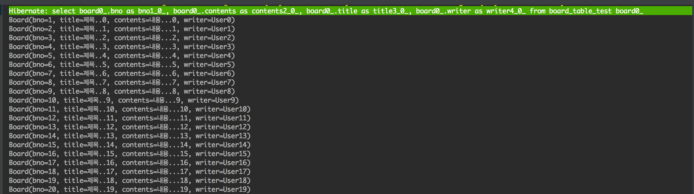
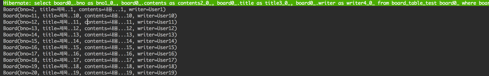

# JPA Query 

## 순서

1. 쿼리 메소드
1. @Query
1. 페이징과 정렬
1. Querydsl


사실상 JPA 의 CrudRepository 만으로도 단순한 crud 작업은 가능하지만 실제로는 좀 더 다양한 기능들이 요구됩니다. 이러한 다양한 요구들을 만족시키는 쿼리를 실습해보겠습니다.

또한 중요한 점은 아무리 간단한 네이밍으로 쿼리 메소드를 작성할 수 있다고 해도 , RDB를 제대로 배우지 않았다면 개념들이 헷갈릴수 있습니다. 꼭 관계형 데이터 베이스에 대해서 제대로 학습을 하는 것을 추천드립니다.

이번 포스트는 쿼리 메소드에 대해서 다루겠습니다.

## 쿼리 메소드를 위한 준비

복잡한 쿼리를 작성하기 위해서는 데이터베이스를 대상으로 하는 SQL이 아니라 JPA 에서 사용하는 Named Query 나 JPQL(Java Persistence Query Language), Query dsl 이라는 것을 학습해야 합니다.

하지만 Spring Data JPA 에서는 이러한 복잡한 과정을 조금이나마 줄여주고자 `쿼리 메소드`라는 기능을 제공합니다. 이는 `이름만으로 필요한 쿼리를 만들어내는 기능`으로 네이밍 룰을 잘 알아야 합니다.

그러면 실제로 적용해보면서 쿼리 메소드가 어떻게 동작하는지 살펴보겠습니다. 

먼저 Board 라는 class 를 하나 만들겠습니다. Board는 아래와 같이 되어있습니다.

```java
// domain/Board.java
package com.example.jpapractice.domain.board;

import lombok.Getter;
import lombok.Setter;
import lombok.ToString;

import javax.persistence.*;

@Getter
@Setter
@Entity
@ToString
@Table(name = "board_table_test")
public class Board {

    @GeneratedValue(strategy = GenerationType.AUTO)
    @Id
    private Long bno;
    private String title;
    private String contents;
    private String writer;

}

```

#### lombok 관련해서는 2번째 포스팅을 확인해보세요

그 다음 BoardRepository를 만들고 테스트코드를 통해 데이터를 넣어줍니다.

```java
// domain/BoardRepository.java (Interface)
package com.example.jpapractice.domain.board;
import org.springframework.data.repository.CrudRepository;
public interface BoardRepository extends CrudRepository<Board,Long> {

}
```


```java
// test/domain/Board.java
package com.example.jpapractice.domain.board;

import org.junit.Test;
import org.junit.runner.RunWith;
import org.springframework.beans.factory.annotation.Autowired;
import org.springframework.boot.test.context.SpringBootTest;
import org.springframework.test.context.junit4.SpringRunner;

@RunWith(SpringRunner.class)
@SpringBootTest
public class BoardTests {
    @Autowired
    BoardRepository BoardRepo;


    @Test
    public void testIns20(){
        for(int i=0;i<20;i++){
            Board board = new Board();
            board.setTitle("제목.."+i);
            board.setContents("내용..."+i);
            board.setWriter("User"+i);
            BoardRepo.save(board);
        }
    }

    @Test
    public void checkData(){
        System.out.println("Check Data!");
        BoardRepo.findAll().forEach(board->{
            System.out.println(board.toString());
        });
    }
}

```

testIns20을 실행하면 데이터베이스에 20개의 row가 들어가고 이를 checkData라는 함수를 통해서 한번 확인해보겠습니다.



#### 한글이 안들어갑니다

만약에 한글이 제대로 들어가지 않는다면 [여기]()를 확인해보세요!

## 쿼리 메소드 사용하기 

이번에는 본격적으로 쿼리 메소드를 사용해 보겠습니다. 주의할 점은 쿼리가 `select` 즉 조회를 할때 쿼리 메소드를 사용한다는 것을 알아두셔야 합니다. 

쿼리 메소드의 몇가지 예시를 들어보겠습니다.

```
find...By
read...By
query...By
get...By
count...By
```

... 공간에 찾고자 하는 엔티티 타입을 지정합니다. 만약에 ... 부분을 생략한다면 현재 실행하는 Repository 기준으로 가져오게 되고, By 뒤쪽에는 가져오고자 하는 칼명을 작성합니다. 예를 들어 제목을 기준으로 찾고 싶다면 findBoardByTitle 이 적절한 네이밍이 됩니다.

리턴타입은 Collection<T> 형태로 보통 List<T> 혹은 Page<T> 가 됩니다. 

> 조금 더 다양한 쿼리 매소드 방식은 [여기](https://docs.spring.io/spring-data/jpa/docs/current/reference/html/#repositories.query-methods)를 참고하세요

실제로 간단한 쿼리 메소드를 작성해 보겠습니다. 

```java
// BoardRepository
public interface BoardRepository extends CrudRepository<Board,Long> {

    public List<Board> findBoardByTitle(String title);

}
```

```java
// testcode 

@Test
public void testQueryTitle(){
    // 제목을 기준으로 찾습니다. 
    BoardRepo.findBoardByTitle("제목..1").forEach(board->{
        System.out.println(board);
    });
}
```
간단한 select 쿼리 메소드를 구현해봤습니다. 이를 실행하면 Board(bno=2, title=제목..1, contents=내용...1, writer=User1) 가 결과로 나옵니다.

그 다음으로 많이 사용하는 like 구문에 대한 처리를 해보겠습니다. 

```java
// BoardRepository
public interface BoardRepository extends CrudRepository<Board,Long> {

    public List<Board> findBoardByTitle(String title);
    public List<Board> findByWriterContaining(String writer);

}
```

```java
// testcode 

@Test
    public void testQueryLike(){
        // % + 키워드 + % 에 대한 처리를 합니다.
        BoardRepo.findByWriterContaining("User1").forEach(board->{
            System.out.println(board);
        });
    }
```



Containing 이라는 네이밍 규칙을 통해서 like 를 찾습니다. 그 외에도 사용되는 like 형식은 아래 표와 같습니다. 참고하시길 바랍니다.

|네이밍|형태|
|---|---|
|Like|단순 like|
|StringWith|키워드 + ' % '|
|EndingWith|' % ' + 키워드|
|Containing|' % ' + 키워드 + ' % '|

### 두개 이상의 속성을 처리하기

And 와 Or 을 사용합니다. 사용하고 싶은 속성 수 만큼 And 나 Or 을 적절하게 사용해야 합니다. 예를 들어 제목과 내용중에 "여름" 이라는 값을 포함하는 개체를 찾고 싶다면 아래와 같이 쿼리메소드를 작성할 수 있습니다.

```java
// BoardRepository
public interface BoardRepository extends CrudRepository<Board,Long> {
    
    public List<Board> findByTitleContainingOrContentsContaining(String title,String contents);

}
```

속성을 두개 사용했기 때문에 파라미터 역시 두개가 사용되었습니다. 결국 `BoardRepo.findByTitleContainingOrContentsContaining("여름","여름")` 이러한 형식이 될 것입니다.

### 부등호 처리

`GreaterThan` 혹은 `LessThan` 이라는 네이밍 규칙을 사용합니다. 예를 들어 id가 10보다 큰 게시물을 검색하고 싶다면 아래와 같은 쿼리메소드가 작성될 것입니다.

```java
// BoardRepository
public interface BoardRepository extends CrudRepository<Board,Long> {
    
    public List<Board> findByBnoGreaterThan(Long bno);

}
```

`BoardRepo.findByBnoGreaterThan(10L)` 와 같은 형식이 될 것입니다.

### 순서 처리

때로는 역순으로 보여줘야 하는 경우가 있습니다. 예를 들어서 게시판의 경우 최신글을 보여줘야 하는 상황에서 default 순서인 `Asc(오름차순)` 을 이용한다면 제일 처음에 등록된 글이 항상 먼저 표현될 것입니다.

역순으로 표현하기 위해서는 `OrderBy` 라는 키워드와 함께 `Desc(내림차순)` 를 사용하면 됩니다. 아래 간단한 예시를 들겠습니다.

```java
// BoardRepository
public interface BoardRepository extends CrudRepository<Board,Long> {
    
    public List<Board> findByBnoGreaterThanOrderByDesc(Long bno);

}
```

`BoardRepo.findByBnoGreaterThanOrderByDesc(10L)` 와 같은 형식이 될 것이고 , 역순으로 나타날 것입니다.


## 마무리


> 참고 
>> Book    : [스타트 스프링 부트](http://www.namgarambooks.co.kr/entry/8-%EC%8A%A4%ED%83%80%ED%8A%B8-%EC%8A%A4%ED%94%84%EB%A7%81-%EB%B6%80%ED%8A%B8?category=584781) <br>