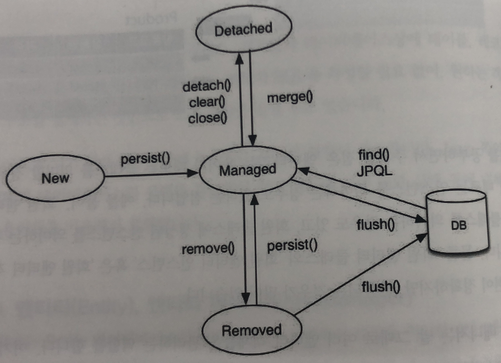

# Spring Data JPA ( Java Persistence API )

## Spring Data 

스프링은 과거 `JDBC` 부터 `ORM` 까지 Spring Data 의 하위 프로젝트를 통해서 다양한 개발방식을 지원하고 있습니다. 
> 자세한 내용은 [Spring data](http://projects.spring.io/spring-data) 를 참고 하시길 바랍니다.

이번에는 spring data 의 하위 프로젝트중 하나인 spring-data-JPA 에 대해서 알아보겠습니다.

## Spring Data JPA 란?
JPA( Java Persistence API ) 라는 기술을 스프링 개발에서 이용할 수 있도록 돕는 라이브러리 입니다. 이를 이용하면 다양한 데이터베이스에 종속적인 SQL문 없이도 개발이 가능하기 때문에 개발의 생산성을 높일 수 있습니다.

JPA 는 자바 관련 기술 스펙의 하나입니다. 다시 말해서 자바를 이용해서 데이터를 관리(유지)하는 기법을 하나의 스펙으로 정리한 표준이라고 할 수 있습니다.

EJB 라는 기술 스펙에서 엔터티빈(Entity Bean) 이라는 데이터를 처리하는 스펙을 정한 것이 JPA의 시초라고 할 수 있습니다. 

이러한 JPA 를 이해하기 위해서는 ORM 에 대해서 먼저 알아야 할 필요가 있습니다.

## ORM 

ORM 은 Object Relational Mapping의 약자로서 객체지향에서 말하는 객체와 데이터베이스의 개체가 상당히 유사하다는 것을 기초로 시작합니다. 

예를 들어 아래와 같은 유저라는 객체를 생성했다고 생각해봅시다.

```java
Class User{
    private int user_num;
    private String user_name;
}
```

이는 데이터베이스에서 int값을 가진 usernum 이라는 속성과 varchar 값을 가진 username 이라는 속성이 포함된 User 릴레이션과 동일하다고 생각할 수 있습니다. 


이러한 유사한 점들이 객체지향에서의 객체와 데이터베이스의 개체를 한번에 처리할 수 있을까 라는 고민점에서 부터 시작 된 것이 ORM 입니다. 이는 특정 데이터베이스에 종속된 개념이 아니고, 객체지향의 객체와 데이터베이스의 개체를 매핑시킨다는 추상적인 개념입니다.

이러한 ORM을 자바에서 구현하기 위해서 사용되는 것이 JPA 입니다. 다시말해 기존 JDBC 를 통해서 직접 구현했던 데이터베이스 관련 작업을 대신 처리해 주는 추상화된 계층의 구현 스펙이라고 할 수 있으며 , 데이터베이스에 대한 처리를 JPA 계층에서 하기 때문에 추상화된 형태의 코드를 제작하는 것 만으로도 개발이 가능하다는 장점이 있습니다.

JPA 는 그 자체로는 스펙에 불과하기 때문에 이를 구현한 프레임워크들의 존재가 필수적이고, 스프링에서 대표적으로 사용되는 것이 [Hibernate](http://hibernate.org) 입니다. 

## JPA 를 사용함으로서 얻는 장점과 단점

- 장점
    1. 데이터베이스 관련 코드에 대해 유연함을 얻을 수 있습니다.
        - 데이터베이스 변경은 화면단부터 시작해 DAO , 서비스등에 많은 영향을 끼칩니다. 이를 JPA를 통해서 구현한다면 설계를 한번에 처리할 수 있기 때문에 높은 효율성을 기대할 수 있습니다.
    1. 데이터베이스와 독립적인 관계입니다.
        - 특정 데이터베이스에서 동작하는 것이 아니기 때문에 버전 이슈나 다른 데이터베이스로 변경한다 해도 큰 변화가 없습니다.
- 단점
    1. 러닝커브(learning curve) 가 높습니다.
        - JPA 를 위해 새로 배워야 하는 개념들이 있습니다.
        - 따라서 기존 데이터베이스 학습 + JPA 를 학습해야 합니다.
    1. 근본적인 객체지향 설계 사상이 반영되어야 합니다.
        - 적합한 객체들의 관계를 중요시합니다. 따라서 객체지향의 대한 개념이 부족한 개발자가 JPA를 사용한다면 고생의 길이 열릴 수 있습니다. 
    1. 특정 데이터베이스의 강력함을 사용할 수 없다는 문제가 있습니다.
        - SQL 튜닝등의 작업에 제약이 생길 수 있습니다.
        - 물론 native SQL을 이용해서 기존 SQL을 사용해 개발을 진행할 수 있지만 , 이렇게 된다면 JPA의 장점을 잃는 한계가 있습니다.

## JPA 개발의 구조

위 글을 통해서 왜 JPA를 사용하는 것인지 알아 보았습니다. 이제는 JPA가 실제로 어떤 프로세스에 의해서 개발이 되는지 알아보겠습니다.

개발은 아래와 같은 프로세스를 거치게 됩니다.

` Application <-> JPA <-> JDBC <-> DataBase `

개발자는 JAVA로 만든 클래스, 객체들과 데이터베이스의 테이블 레코드 등을 자동으로 관리하게 됩니다. 또한 따로 SQL 문을 작성할 필요가 없기 때문에 생산성이 높아집니다. ( 물론 SQL을 사용할 수도 있습니다. )

따라서 JPA의 역할이 중요하고 JAVA쪽 메모리 상태와 데이터베이스 메모리 상태를 관리해야 하기 때문에 이에 대한 상태들에 대해서 별도의 용어들을 사용합니다. 아래에 정리해두었으니 잘 알아두셔야 합니다.

## 엔티티 (Entity) 

- 데이터 베이스
    - 엔티티는 데이터베이스상에서 데이터로 관리하는 대상을 의미합니다.
    - 보통 이를 위해서 일반적으로 테이블을 설계하고, 데이터를 추가할 수 있으며 이렇게 추가된 데이터를 인스턴스 혹은 레코드 라고 부릅니다.
- JPA
    - Java에서는 엔티티 타입의 존재가 하나의 클래스가 됩니다. 

JPA에서 하나의 엔티티 타입을 생성한다는 것은 하나의 클래스를 만든다 라고 생각하셔야 합니다.

#### 주의할 점은 JPA에서 하나의 클래스는 엔티티 타입을 의미할 때도 있지만 ,엔티티의 인스턴스를 의미하는 경우도 있기 때문에 이를 혼동하지 않는 것이 중요합니다. 

## 엔티티 매니저(Entity Manager)

말 그대로 엔티티들을 관리하는 역할을 합니다. 이를 위해서 자신이 관리해야 하는 엔티티 객체들을 `영속 컨텍스트(Persistence Context)`에 넣어두고 , 객체들의 생사(Life Cycle) 을 관리하게 됩니다.

#### 아래의 부분은 JPA가 실제로 동작하는 방식입니다. 직접 코딩으로 엔티티 매니저를 건드릴 필요는 없지만 어떻게 동작하는지 알아두는 것은 좋다고 생각합니다.



영속 컨텍스트는 JPA가 엔티티 객체들을 모아 놓는 공간이라고 생각하면 좋습니다. 총 4가지의 상태로 구분될 수 있습니다. 

1. New(비영속)
    - 자바에만 존재하는 순수 자바 객체
    - 데이터베이스와 연동된 적이 없음
1. Managed(영속)
    - 데이터베이스에 저장되고 , 메모리 상에서도 같은 상태로 존재하는 객체
    - id(PK) 값을 통해서 필요한 엔티티 객체를 꺼내어 관리할 수 있다.
1. Removed(삭제)
    - DB에서 삭제된 객체
    - 더이상 영속 컨텍스트에 속하지 않음
1. Datached(준영속)
    - 영속 컨텍스트에서 엔티티 객체를 꺼내서 사용하는 상태
    - 즉 아직 데이터베이스와 동기화가 이루어지지 않은 상태 


## 마무리


> 참고 
>> 책    : [스타트 스프링 부트](http://www.namgarambooks.co.kr/entry/8-%EC%8A%A4%ED%83%80%ED%8A%B8-%EC%8A%A4%ED%94%84%EB%A7%81-%EB%B6%80%ED%8A%B8?category=584781) <br>
>> 블로그 : []()