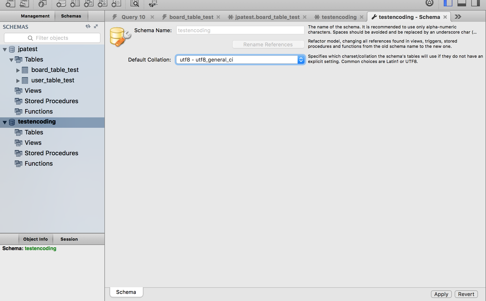
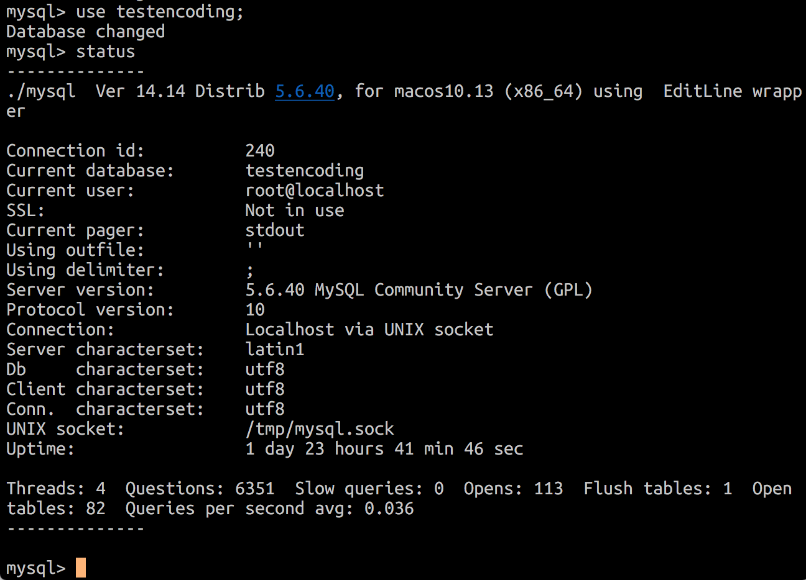
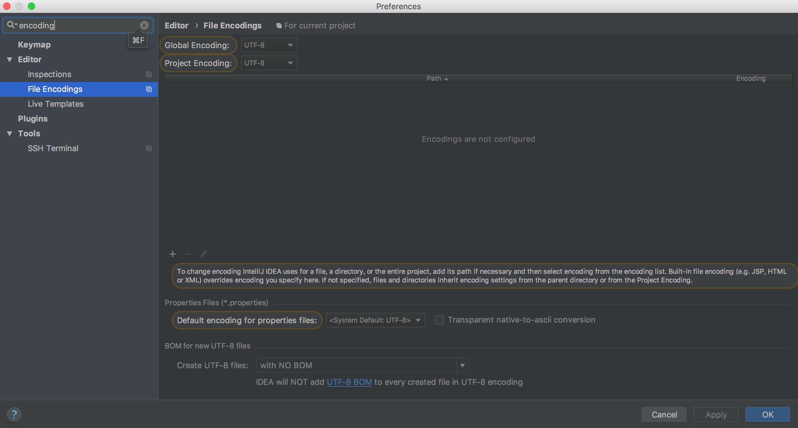

# Error 

# Spring database API ( JPA )

## Error creating bean with name 'entityManagerFactory' 
- spring boot 2.0 issue
- setting maven 

```
<dependency>
    <groupId>org.hibernate</groupId>
    <artifactId>hibernate-core</artifactId>
    <version>5.2.17.Final</version>
</dependency>
<dependency>
    <groupId>org.hibernate</groupId>
    <artifactId>hibernate-entitymanager</artifactId>
    <version>5.2.17.Final</version>
</dependency>
```

- \+ java 9 setting

```
<dependency>
    <groupId>javax.xml.bind</groupId>
    <artifactId>jaxb-api</artifactId>
    <version>2.3.0</version>
</dependency>
```

> https://stackoverflow.com/questions/40058001/error-creating-bean-with-name-entitymanagerfactory-defined-in-class-path-resou#


## SpringBoot mysql 연결
##### gradle ( maven 확인 x )
spring 에서 mysql 을 연결할 때 mysql-connector 라는 라이브러리를 이용한다. 문제는 gradle 에서 호환이 아직 잘 안되어서 그런지 connector 최신 라이브러리를 사용했을 때 jdbc 를 인식하지 못하는 에러가 발생했다.
- 해결
    - connector 버전을 6.0.6 으로 낮추니 제대로 인식하게 되어 해결되었다.
    - mysql 은 5.6 v

## JPA 한글처리 ( 인코딩 ) 문제 

구글링을 정말 많이했는데 , 사실상 문제는 다른곳에 있어서 정말 허무했습니다... 

체크하실 부분은 3가지 입니다.
1. database 인코딩이 제대로 되어있는가?
1. IDE 인코딩이 제대로 되어있는가?
1. jpa 와 database 연결이 제대로 되어있는가?


### database 인코딩
database 인코딩은 mysql 5.7+ 버전을 사용하신다면 기본적으로 utf8 으로 되어있는 것으로 알고 있습니다. 하지만 저는 5.6 버전을 사용하는데 기본 인코딩 ( characterset ) 이 latin1 으로 되어있어 처음에 한글이 들어가지 않았습니다.

이를 해결하기 위해서 mysqlWorkbench 에서 테이블을 만들고 ( `create database testencoding;` )  chracter set을 따로 설정했습니다. 인코딩 설정 후 apply 버튼을 꼭 눌러주세요. 



그 후 사용하는 데이터베이스로 접속해 status 를 입력했을때 utf8 이 되어있다면 제대로 설정이 된것입니다. 



### IDE 인코딩

database 문제가 아니라면 IDE에서 한글을 제대로 처리하지 않아서 그럴 수도 있습니다. 인코딩 설정을 꼭 확인해보세요 intellij 같은 경우는 커멘드+, 를 통해서 설정창을 불러온 뒤 encoding 을 검색하면 빠르게 찾을 수 있습니다.



### jpa database 연결 설정 

저 같은 경우는 여기가 문제였습니다. jpa 상 인코딩 자체가 database의 인코딩과 맞지 않아서 한글이 제대로 들어가질 않았고 이를 간단하게 application.properties에서 해결했습니다.

`spring.datasource.url=jdbc:mysql://localhost:3306/jpatest?useUnicode=true&characterEncoding=utf8`

chracterEncoding=utf8 을 통해서 jpa와 database의 인코딩 설정을 동일하게 해주니 한글이 설정되었습니다! 