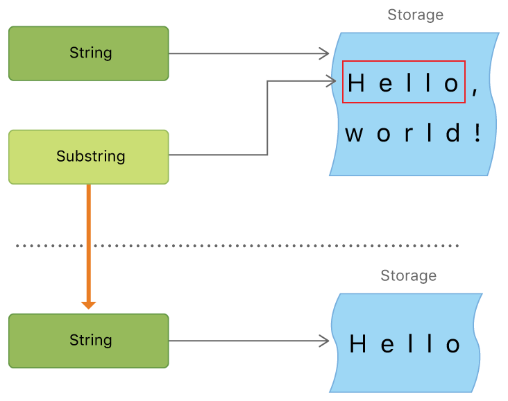

# Strings and Characters 

## 문자열 리터럴

### 여러줄 문자열 리터럴

여러줄의 문자열을 초기화하고 싶은 경우 아래와 같이 선언할 수 있다. 만약 줄바꿈을 하고 싶다면 `\`를 사용한다.

```swift
let hello = """
world \ and

hello swift !!
"""
```

### 문자열 리터럴의 특수문자

- \0, \, \t, \n, \r, \”, \’
- \u{n}, n은 1-8자리 십진수 형태로 구성된 유니코드
```swift
let wiseWords = "\"Imagination is more importan than knowledge"\ - Einstein"
// "Imagination is more important than knowlege" - Einstein
let dollaSign = "\u{24}"            // $, 유니코트 U+0024
let blackHeart = "\u{2665}"         // ♥, 유니코드 U+2665
let sparklingHeart = "\u{1F496}" // 💖,유니코드 U+1F496
```

## 문자

문자열의 개별 문자를 for-in loop을 사용해 접근할 수 있습니다.


```swift
for character in "Dog!🐶" {
    print(character)
}
// D
// o
// g
// !
// 🐶
```

## 문자열 삽입

`\` 를 이용해 중간에 상수나 변수를 집어넣을 수 있다.

```swift
let mutiplier = 3
let message = "\(multiplier) times 2.5 is \(Double(multiplier) * 2.5)"
// message : "3 times 2.5 is 7.5"
```

### 문자열과 캐릭터
문자열의 개별 문자를 접근하기 위해서는 indices 프로퍼티를 사용합니다.
```swift
for index in greeting.indices {
    print("\(greeting[index]) ", terminator: "")
// G u t e n  T a g !
```

### 문자 메서드

RangeReplaceableCollection 프로토콜을 따르는 Array, Dictionary, Set 등에서도 동일하게 사용할 수 있습니다.

insert(:at:), insert(contentsOf:at:), remove(at:), removeSubrange(:) 과 같은 매소드를 사용할 수 있습니다.

## 부분문자열

문자열에서 부분적으로 문자를 얻기 위해 prefix (_:)와 같은 서브스크립트 매소드를 이용할 수 있는데, 그렇게 얻은 부분 문자열은 문자열(String) 인스턴스가 아니라 `부분 문자열(SubString) 인스턴스` 입니다. 만약 부분 문자열을 단기간에 사용하는게 아니라 오랜기간 사용한다면 문자열 인스턴스로 바꿔서 사용하는게 좋습니다.

```swift
let greeting = "Hello World!"
let index = greeting.index(of: ",") ?? greeting.endIndex
let beginning = greeting[..<index]
// beginning : Hello
​
// SubString인 beginning을 String으로 변환
let newString = String(beginning)

```

위와 같이 사용해야하는 것이 좋은 이유는 메모리 관리 때문입니다. SubString은 해당 문자를 직접 갖고 있는 것이 아니라 원본 String의 메모리를 참조해 사용합니다.



## 접두사 접미사

접두사와 접미사의 비교를 위해 hasPrefix(:), hasSuffix(:) 매소드를 사용할 수 있습니다.
```swift
var mansionCount = 0
var cellCount = 0
for scene in remeoAndJuliet {
    if scene.hasSuffix("Capulet's mansion") {
        mansionCount += 1
    } else if scene.hasSuffix("Friar Lawrence's cell") {
        cellCount += 1
    }
}
print("\(mansionCount) mansion scenes; \(cellCount) cell scenes")
// 6 mansion scenes; 2 cell scenes
```


>[문자열과 문자 (Strings and Characters)](https://jusung.gitbook.io/the-swift-language-guide/strings-and-characters)