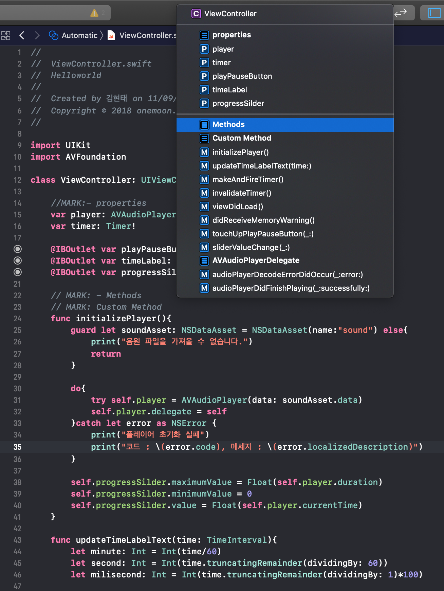
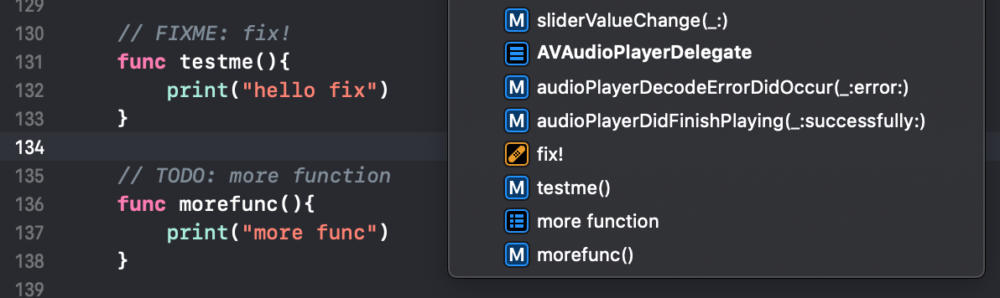

# Tip for Swift or Xcode

## Interface builder

인터페이스 빌더에서 cntl+드래그를 통해서 함수를 코드상으로 간단하게 만들 수 있다.

## MARK 

Swift의 문법중 사용자의 편의성을 위해 나온 문법이 MARK 이다. 이는 사용자가 보기 편하게끔 헤드라인을 잡아주는 역할을 한다.

상단의 주석을 살펴보자

- // MARK : a
- // MARK : - b

위의 2개의 형식으로 MARK 가 되어있는 것을 볼 수 있다. 보이다시피 `-`가 추가되면 상단에 하나의 경계선이 생겨서 가독성을 더욱 높일 수 있다.

### FIXME , TODO

MARK 뿐만 아니라 Swift 에서는 FIXME 와 TODO 2가지 키워드를 더 제공한다. 사용법과 적용 모습은 아래 이미지를 참고하면 된다.

위와 같이 표현하면 status bar 에 3가지 키워드가 모두 다르게 표시 된다는 것을 확인할 수 있다. 이를 활용한다면 적절한 지표가 될 것 같다.